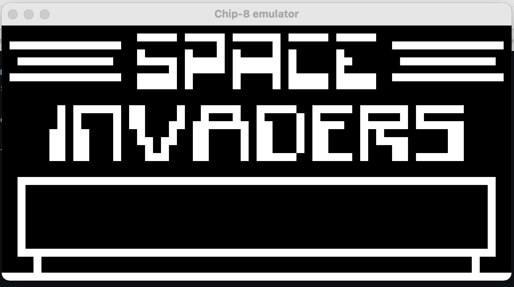
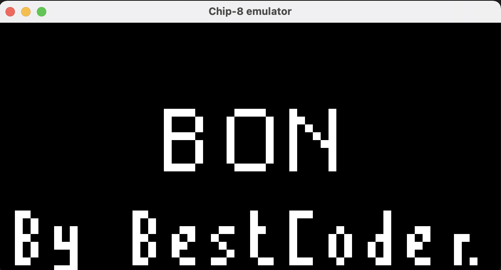
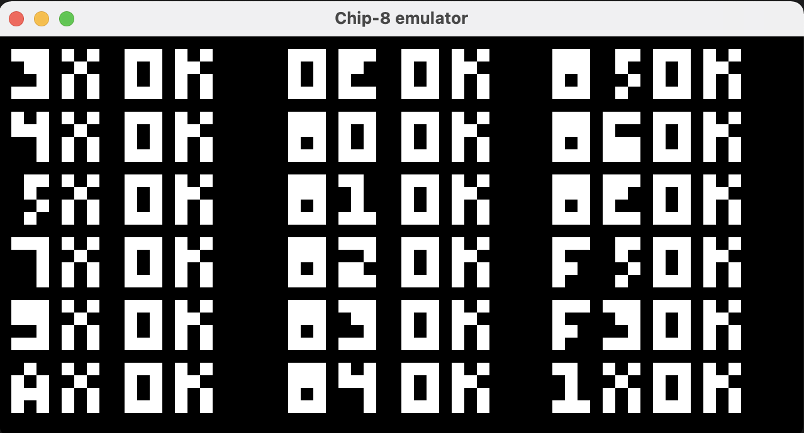

# Rusty Chip-8 emulator

Chip-8 emulator written in Rust

## Test Roms

Two roms can be used to check if graphics are rendered correctly.

- test_rendering.ch8: Test conditional jumps, mathematical and logical operations of the chip8 ([more detailed explanation](https://slack-files.com/T3CH37TNX-F3RKEUKL4-b05ab4930d)).
- test_opcode.ch8: Test operations (read, write, compare etc.) on chip8 registers ([more detailed explanation](https://github.com/corax89/chip8-test-rom))

### Sreenshot when test_rendering is successful

### Screenshot when test_opcode is successful

## Resources

- [Cowgod's Chip-8 Reference](http://devernay.free.fr/hacks/chip8/C8TECH10.HTM)
- [How to write an emulator](http://www.multigesture.net/articles/how-to-write-an-emulator-chip-8-interpreter/)
- [Mastering Chip-8](https://github.com/mattmikolay/chip-8/wiki/Mastering-CHIP-8)
- [Chip8 emulator with code snippets in C++](https://austinmorlan.com/posts/chip8_emulator/)
